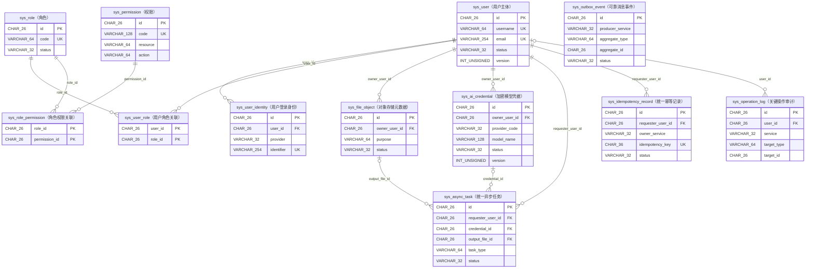
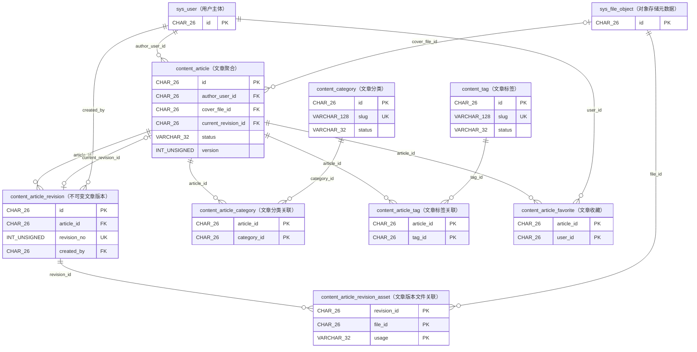
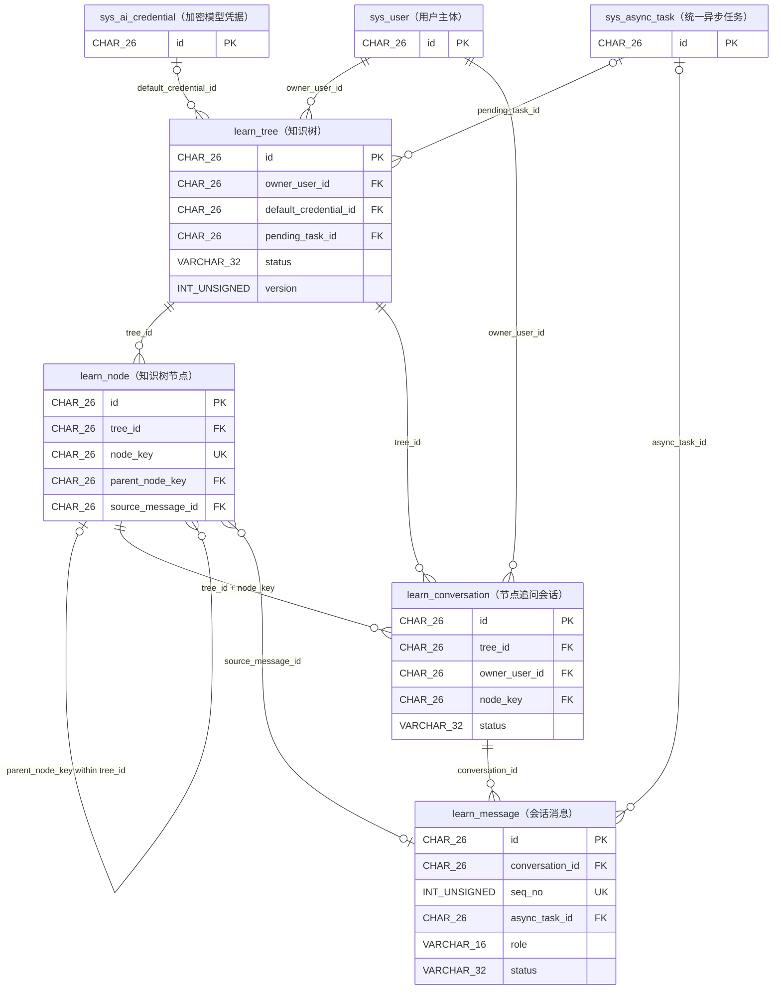

# 实体关系图（ER 图）

本图从 [`04-schema.sql`](04-schema.sql) 提取，覆盖一期全部 38 张表。由于建库脚本刻意不创建跨服务外键，图中的连线表示**逻辑引用**：写入方必须在所属服务的应用层完成资源存在性、归属和状态校验，不能依赖数据库跨服务联表或级联操作。

图例：`||--o{` 表示一对多；`o|` 表示可选的一；关联表用于表达多对多关系。实体内仅保留主键、关联键以及接口实现需要特别留意的并发/状态字段；完整字段、索引和约束以 [`04-schema.sql`](04-schema.sql) 为准。

## 1. 平台、认证、文件与 AI

`sys_outbox_event.aggregate_id`、`sys_idempotency_record.resource_id`、`sys_operation_log.target_id` 为多态业务 ID；其目标由同一记录中的类型字段决定，因此不画为固定实体连线。

## 2. 内容域

`content_article.created_by`、`updated_by` 也逻辑引用 `sys_user.id`，与 `author_user_id` 的校验方式相同；图中省略重复审计边。

## 3. 学习域

`learn_node` 的父子关系使用 `(tree_id, node_key)` 这个唯一键限定；`learn_conversation.node_key` 也必须属于同一 `tree_id` 且为叶子节点。这两项都是应用层状态与归属校验，不是数据库外键。

## 4. 题库与练习域

```mermaid
erDiagram
    "sys_user（用户主体）" {
        CHAR_26 id PK
    }
    "sys_file_object（对象存储元数据）" {
        CHAR_26 id PK
    }
    "sys_ai_credential（加密模型凭据）" {
        CHAR_26 id PK
    }
    "sys_async_task（统一异步任务）" {
        CHAR_26 id PK
    }
    "question_library（用户题库）" {
        CHAR_26 id PK
        CHAR_26 owner_user_id FK
        VARCHAR_32 library_type
        VARCHAR_32 status
        INT_UNSIGNED version
    }
    "question_import（MinerU 导入）" {
        CHAR_26 id PK
        CHAR_26 library_id FK
        CHAR_26 credential_id FK
        CHAR_26 source_archive_file_id FK
        CHAR_26 markdown_file_id FK
        CHAR_26 error_file_id FK
        CHAR_26 task_id FK
        VARCHAR_32 status
    }
    "question_import_asset（导入图片关联）" {
        CHAR_26 id PK
        CHAR_26 import_id FK
        CHAR_26 file_id FK
    }
    "question_item（规范题目）" {
        CHAR_26 id PK
        CHAR_26 owner_user_id FK
        CHAR_26 import_id FK
        VARCHAR_32 type
        VARCHAR_32 status
        INT_UNSIGNED version
    }
    "question_option（选择题选项）" {
        CHAR_26 id PK
        CHAR_26 question_id FK
        VARCHAR_3 option_key UK
    }
    "question_library_item（题库题目关联）" {
        CHAR_26 library_id PK
        CHAR_26 question_id PK
        VARCHAR_32 source_type
    }
    "question_item_asset（题目文件关联）" {
        CHAR_26 question_id PK
        CHAR_26 file_id PK
        VARCHAR_32 usage PK
    }
    "question_tag（用户知识点标签）" {
        CHAR_26 id PK
        CHAR_26 owner_user_id FK
        VARCHAR_64 name UK
    }
    "question_item_tag（题目知识点关联）" {
        CHAR_26 question_id PK
        CHAR_26 tag_id PK
    }
    "practice_session（练习会话）" {
        CHAR_26 id PK
        CHAR_26 user_id FK
        VARCHAR_32 scope
        VARCHAR_32 mode
        VARCHAR_32 status
    }
    "practice_session_library（练习选择题库）" {
        CHAR_26 session_id PK
        CHAR_26 library_id PK
    }
    "practice_question_snapshot（练习题目快照）" {
        CHAR_26 id PK
        CHAR_26 session_id FK
        CHAR_26 question_id FK
        INT_UNSIGNED sequence_no UK
    }
    "practice_answer（练习最终作答）" {
        CHAR_26 id PK
        CHAR_26 session_id FK
        CHAR_26 snapshot_id FK
        VARCHAR_32 result
    }
    "practice_mastery（题目掌握度）" {
        CHAR_26 user_id PK
        CHAR_26 question_id PK
        VARCHAR_32 mastery_level
    }

    "sys_user（用户主体）" ||--o{ "question_library（用户题库）" : "owner_user_id"
    "question_library（用户题库）" ||--o{ "question_import（MinerU 导入）" : "library_id"
    "sys_ai_credential（加密模型凭据）" ||--o{ "question_import（MinerU 导入）" : "credential_id"
    "sys_file_object（对象存储元数据）" ||--o{ "question_import（MinerU 导入）" : "source_archive_file_id"
    "sys_file_object（对象存储元数据）" o|--o{ "question_import（MinerU 导入）" : "markdown_file_id / error_file_id"
    "sys_async_task（统一异步任务）" ||--o| "question_import（MinerU 导入）" : "task_id"
    "question_import（MinerU 导入）" ||--o{ "question_import_asset（导入图片关联）" : "import_id"
    "sys_file_object（对象存储元数据）" ||--o{ "question_import_asset（导入图片关联）" : "file_id"
    "sys_user（用户主体）" ||--o{ "question_item（规范题目）" : "owner_user_id"
    "question_import（MinerU 导入）" o|--o{ "question_item（规范题目）" : "import_id"
    "question_item（规范题目）" ||--o{ "question_option（选择题选项）" : "question_id"
    "question_library（用户题库）" ||--o{ "question_library_item（题库题目关联）" : "library_id"
    "question_item（规范题目）" ||--o{ "question_library_item（题库题目关联）" : "question_id"
    "question_item（规范题目）" ||--o{ "question_item_asset（题目文件关联）" : "question_id"
    "sys_file_object（对象存储元数据）" ||--o{ "question_item_asset（题目文件关联）" : "file_id"
    "sys_user（用户主体）" ||--o{ "question_tag（用户知识点标签）" : "owner_user_id"
    "question_item（规范题目）" ||--o{ "question_item_tag（题目知识点关联）" : "question_id"
    "question_tag（用户知识点标签）" ||--o{ "question_item_tag（题目知识点关联）" : "tag_id"
    "sys_user（用户主体）" ||--o{ "practice_session（练习会话）" : "user_id"
    "practice_session（练习会话）" ||--o{ "practice_session_library（练习选择题库）" : "session_id"
    "question_library（用户题库）" ||--o{ "practice_session_library（练习选择题库）" : "library_id"
    "practice_session（练习会话）" ||--o{ "practice_question_snapshot（练习题目快照）" : "session_id"
    "question_item（规范题目）" ||--o{ "practice_question_snapshot（练习题目快照）" : "question_id"
    "practice_session（练习会话）" ||--o{ "practice_answer（练习最终作答）" : "session_id"
    "practice_question_snapshot（练习题目快照）" ||--o| "practice_answer（练习最终作答）" : "snapshot_id"
    "sys_user（用户主体）" ||--o{ "practice_mastery（题目掌握度）" : "user_id"
    "question_item（规范题目）" ||--o{ "practice_mastery（题目掌握度）" : "question_id"
```

练习中的 `practice_question_snapshot` 是创建会话时的题目冻结副本；答题必须指向该快照，不能依赖题目当前内容。`practice_session_library` 只记录创建范围，实际出题集由快照决定。

## 接口开发前的关联校验清单

1. 用户私有资源（题库、题目、题签、知识树、会话、文件、AI 凭据）必须同时校验 `id` 和当前用户归属，不能只按 ID 查询。
2. 写入多对多关联前，校验两端资源均存在、状态可用且归属一致；例如题目加入题库、题目打标签、练习选择题库、文章绑定分类/标签。
3. 异步任务创建时，业务聚合与 `sys_async_task` 在各自服务的本地事务中绑定；任务成功后才可读取最终资源。任务、文件和 AI 凭据的跨服务 ID 均通过服务 API 或事件同步校验。
4. 修改带 `version` 的聚合根时按 HTTP `If-Match` 做乐观锁更新；关联表的重复写入依赖复合主键保证幂等。
5. `sys_outbox_event`、`sys_idempotency_record` 和 `sys_operation_log` 是平台通用表。它们的多态资源 ID 必须结合类型字段解释，接口层不能假定固定目标表。
